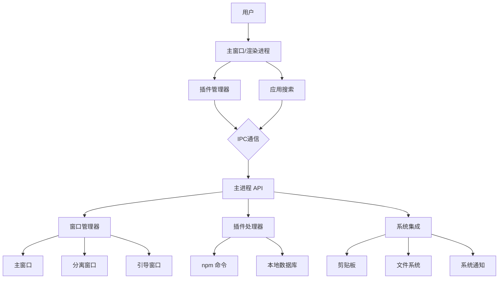
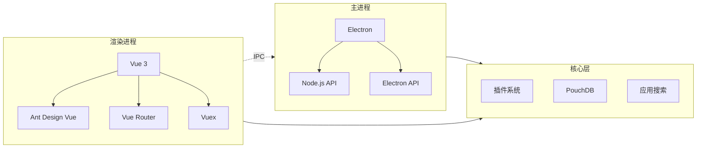
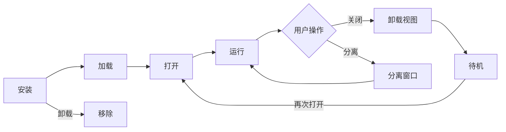
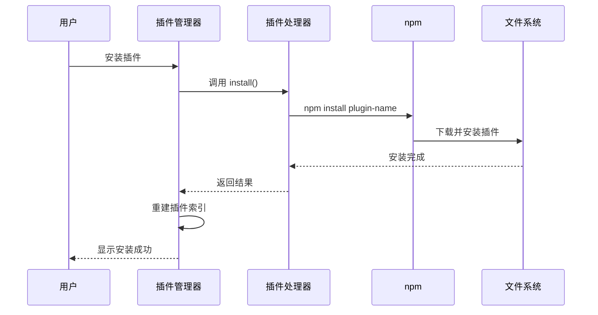
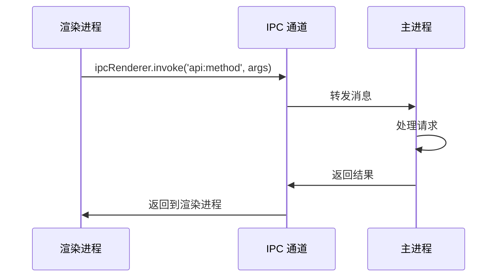
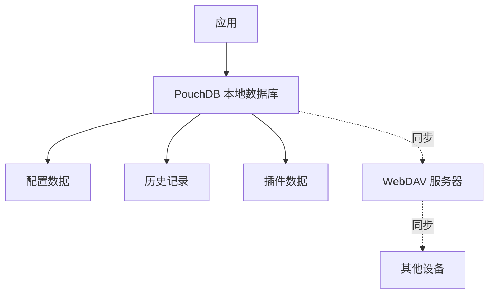
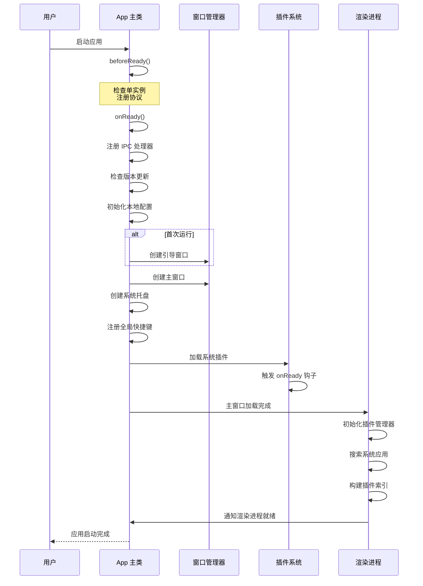

# Ruck 架构文档

## 📋 概述

Ruck 是一个基于 Electron + Vue3 的跨平台桌面效率工具箱，采用插件化架构设计。本文档详细说明了 Ruck 的整体架构、核心模块、数据流和通信机制。

**核心特点**：
- 基于 Electron 的跨平台桌面应用
- 插件化架构，支持 UI、System、App 三种插件类型
- 基于 npm 的插件管理系统
- 主进程与渲染进程分离
- 支持 WebDAV 多端数据同步

---

## 🏗️ 整体架构

### 架构图



### 技术架构



---

## 📁 目录结构

```
ruck/
├── src/                          # 源代码目录
│   ├── main/                     # 主进程代码
│   │   ├── index.ts             # 主进程入口，应用生命周期管理
│   │   ├── browsers/            # 窗口创建器
│   │   │   ├── main.ts         # 主窗口创建器
│   │   │   ├── guide.ts        # 引导窗口创建器
│   │   │   └── detach.ts       # 分离窗口创建器
│   │   ├── common/              # 主进程公共模块
│   │   │   ├── api.ts          # API 接口类
│   │   │   ├── registerHotKey.ts    # 全局快捷键注册
│   │   │   ├── registerSystemPlugin.ts # 系统插件注册
│   │   │   ├── tray.ts         # 系统托盘
│   │   │   ├── db.ts           # 数据库基类
│   │   │   └── ...
│   │   └── ipc/                 # IPC 处理器
│   │       └── handlers/       # IPC 处理函数
│   │
│   ├── renderer/                # 渲染进程代码
│   │   ├── main.ts             # 渲染进程入口
│   │   ├── App.vue             # 根组件
│   │   ├── plugins-manager/    # 插件管理器
│   │   │   ├── index.ts        # 插件管理器主文件
│   │   │   ├── search.ts       # 搜索管理
│   │   │   ├── options.ts      # 选项管理
│   │   │   └── search/         # 搜索相关
│   │   └── components/         # Vue 组件
│   │
│   ├── core/                    # 核心功能模块（可在主/渲染进程使用）
│   │   ├── plugin-handler/     # 插件处理器
│   │   │   └── index.ts        # 插件安装、卸载、更新
│   │   ├── app-search/         # 应用搜索
│   │   │   ├── index.ts        # 搜索入口
│   │   │   ├── darwin.ts       # macOS 应用搜索
│   │   │   ├── win.ts          # Windows 应用搜索
│   │   │   └── linux.ts        # Linux 应用搜索
│   │   ├── db/                 # 数据库
│   │   └── screen-capture/     # 截图功能
│   │
│   ├── common/                  # 公共代码（主/渲染进程共享）
│   │   ├── constants/          # 常量定义
│   │   └── utils/              # 工具函数
│   │
│   └── types/                   # TypeScript 类型定义
│
├── feature/                     # 插件市场子应用
├── detach/                      # 分离窗口子应用
├── tpl/                         # 插件开发模板
├── guide/                       # 引导页面
├── public/                      # 静态资源
└── build/                       # 构建输出目录
```

---

## 🔧 核心模块

### 1. 主进程（Main Process）

**职责**：
- 应用生命周期管理
- 窗口创建和管理
- 系统集成（托盘、快捷键、通知等）
- 插件系统管理
- IPC 通信处理

**关键文件**：

#### `src/main/index.ts` - 应用主类
负责整个应用的生命周期管理，包括：
- 初始化配置
- 创建窗口
- 注册快捷键
- 注册系统插件
- 处理应用退出

#### `src/main/common/api.ts` - API 接口
提供所有主进程功能的统一接口，包括：
- 窗口操作（显示、隐藏、移动、缩放）
- 插件操作（加载、卸载、分离）
- 数据库操作
- 系统功能（剪贴板、文件对话框、通知等）

#### `src/main/common/registerHotKey.ts` - 快捷键管理
注册和管理所有全局快捷键：
- 主窗口显示/隐藏快捷键
- 截图快捷键
- 分离窗口快捷键
- 用户自定义快捷键
- 双击修饰键支持（使用 uIOhook）

### 2. 渲染进程（Renderer Process）

**职责**：
- UI 渲染和用户交互
- 插件搜索和展示
- 插件历史记录管理
- 调用主进程 API

**关键文件**：

#### `src/renderer/main.ts` - 渲染进程入口
初始化 Vue 应用，注册组件

#### `src/renderer/App.vue` - 根组件
主窗口的根组件，包括：
- 搜索框
- 插件列表
- 插件视图容器

#### `src/renderer/plugins-manager/index.ts` - 插件管理器
渲染进程的核心模块，负责：
- 插件搜索和索引
- 插件加载和打开
- 插件历史记录
- 状态管理

### 3. 核心模块（Core Modules）

核心模块可以在主进程和渲染进程中使用。

#### `src/core/plugin-handler/` - 插件处理器
负责插件的全生命周期管理：
- 插件安装（通过 npm）
- 插件卸载
- 插件更新
- 插件升级检查
- 插件信息获取

**特点**：
- 使用任务队列避免并发冲突
- 支持重试机制
- 支持自定义 npm registry

#### `src/core/app-search/` - 应用搜索
跨平台的系统应用搜索：
- macOS：通过 `get-mac-apps` 获取应用
- Windows：扫描开始菜单和常见路径
- Linux：扫描 `.desktop` 文件

支持拼音搜索和缩写搜索。

#### `src/core/db/` - 本地数据库
基于 PouchDB 的本地数据存储，用于存储：
- 插件配置
- 历史记录
- 用户偏好设置

---

## 🔌 插件系统

### 插件类型

Ruck 支持三种类型的插件：

#### 1. UI 插件（ui）
带界面的插件，在主窗口中以 BrowserView 的形式展示。

**特点**：
- 独立的 HTML/JS/CSS
- 可以与主进程通信
- 支持分离到独立窗口

**示例**：计算器、翻译工具、待办事项等

#### 2. 系统插件（system）
在后台运行的插件，可以修改 Ruck 的核心行为。

**特点**：
- 无 UI 界面
- 可以访问 Electron API
- 在应用启动时加载
- 可以注册生命周期钩子

**示例**：快捷键扩展、主题插件、全局搜索增强等

#### 3. 应用插件（app）
本地应用的快速启动方式。

**特点**：
- 通过 `exec` 命令启动应用
- 支持自定义启动命令

**示例**：VSCode、Chrome、Terminal 等

### 插件结构

每个插件都是一个 npm 包，包含 `plugin.json` 配置文件：

```json
{
  "name": "plugin-name",
  "pluginName": "插件显示名称",
  "version": "1.0.0",
  "description": "插件描述",
  "entry": "index.js",
  "main": "index.html",
  "logo": "logo.png",
  "pluginType": "ui",
  "features": [
    {
      "code": "hello",
      "explain": "Hello World",
      "cmds": ["hello", "你好"]
    }
  ]
}
```

### 插件生命周期



### 插件管理流程



---

## 📡 数据流与通信

### IPC 通信机制

主进程和渲染进程通过 IPC（进程间通信）交互：



**通信方式**：
1. **invoke/handle**：异步请求-响应（新 API）
2. **send/on**：单向消息传递（保持兼容）
3. **sendSync/on**：同步请求-响应（向后兼容）

### 数据存储



**存储内容**：
- 用户配置（主题、快捷键等）
- 插件历史记录
- 插件使用数据
- 本地启动应用列表

**同步机制**：
- 支持 WebDAV 协议
- 数据导出/导入
- 多端同步

---

## 🚀 启动流程



---

## 🔐 安全考虑

### 当前状态

- ✅ 单实例锁定
- ✅ 用户数据本地存储
- ✅ WebDAV 同步支持
- ⚠️ `nodeIntegration: true`（存在安全风险）

### 改进建议

1. **使用 contextBridge**
   - 禁用 `nodeIntegration`
   - 通过 preload 脚本暴露安全的 API
   - 实现 CSP 策略

2. **插件沙箱**
   - 限制插件的 API 访问权限
   - 插件权限声明和审核机制

3. **代码签名**
   - macOS 公证
   - Windows 代码签名

---

## 📊 性能优化

### 已实现的优化

1. **插件搜索索引**
   - 预构建索引，加快搜索速度

2. **版本信息缓存**
   - 缓存插件版本信息，减少网络请求

3. **任务队列**
   - 串行执行插件操作，避免冲突

4. **防抖搜索**
   - 减少搜索频率，提升性能

### 优化建议

1. **启动优化**
   - 延迟加载非核心功能
   - 预加载常用插件

2. **渲染优化**
   - 虚拟滚动（大量插件时）
   - 图标缓存

3. **并发优化**
   - 使用 Web Worker 处理应用搜索
   - 异步加载插件信息

---

## 🔄 扩展性

### 子应用系统

Ruck 使用子应用架构，每个功能模块都是独立的 Vue 应用：

**子应用列表**：
- `feature/` - 插件市场
- `detach/` - 分离窗口
- `tpl/` - 插件开发模板
- `guide/` - 引导页面

**优势**：
- 独立开发和部署
- 职责分明
- 易于维护

### 插件生态

基于 npm 的插件系统具有以下优势：

1. **简单易用**：开发者熟悉 npm 生态
2. **版本管理**：使用 npm 的语义化版本
3. **依赖管理**：自动处理插件依赖
4. **发布方便**：直接发布到 npm 或私有 registry

---

## 📚 相关文档

- [贡献指南](CONTRIBUTING.md)
- [插件开发文档](docs/plugin-development.md)
- [API 文档](API.md)
- [用户指南](docs/user-guide.md)

---

## 总结

Ruck 采用清晰的分层架构和模块化设计，通过 Electron 实现跨平台支持，通过 Vue3 提供现代化的 UI，通过基于 npm 的插件系统实现强大的扩展性。整体架构简洁而强大，易于理解和扩展。
